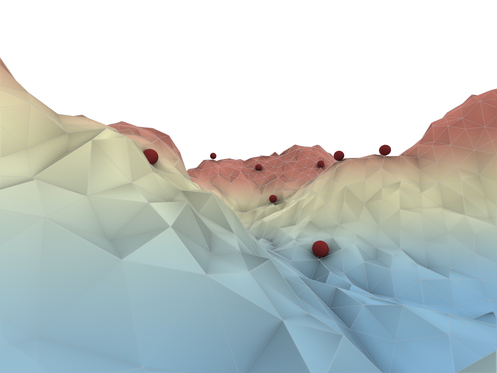

# AgentBasedModeling_ITECH
Agent based modeling assgnment completed at the ITECH program
## ROBOT DIGGERS

Mengxi He, Phillip Kragll, Alan Eskildsen, 

###	Motivation
Site preparation and earth relocation are proposed as a viable application for autonomous robotics, given their relative simplicity in relation to other types of construction tasks. These tasks are conceptualized as a sequential set of states or robot “modes” which determine the specific actions a robot should take during various stages of its deployment.

Additionally, a system that works with a certain level of environmental perception is prefered, being this a key in the deployment of autonomous robots. This has a foundation in recent advances and available state-of the art technology in the collection and processing of environmental data for various purposes such as self-driving automoviles. Various types of sensors currently offer the possibility of collecting data in 360 degree views (eg. camera, RADAR & LiDar)[1], as well as object detector algorithms such as Voxel Net [1] for processing clouds of points with lower computational cost.

Finally an agent based model is implemented, where the robot is represented as a Boid agent, its detection system implemented with an Intersection.MeshRay Method[3] and its subsumption architecture is made possible by a state machine [4].

###	Methods
The agent based model is implemented using the ICD:ABM Modeling Framework with the following methods:

●	A mesh generator was used to create the mesh environment. In upstream modeling parameters such as texture and topography were used to simulate a rough and natural-like terrain by moving 3d points randomly in z, x and y directions, this way it was ensured that the agents would be able to move through valleys and peaks. 
●	Generic components native to the framework were used including Boid Agent, Boid Separation, Boid Containment behaviors and Boid Agent System with the mesh as an environment.
●	A behavior was coded for the Boid agents including a set of specific functions.
○	A class is implemented using Intersection.MeshRay to find the points that are visible to the agent within a specific distance range and the highest and lowest point within this range that will guide its direction
○	Various behaviors are implemented to define the behavior of the agent under specific conditions, these include Dig, Pile, Go up, Go Down, Piling and Digging.
○	A State machine structure is implemented into the execution function to switch the different states. The robot is initialized with the state: goHigh. Then the switch is implemented in the execution for the switching of different states. 

###	Results
The outcome changes heavily dependent on the input variables - Within a good setting the goal of flattening the mesh surface is getting quite obvious  furthermore an emergent clustering of the agents appears.

1.	Source: LiDAR point-cloud based 3D object detection implementation with colab {Part-1 of 2}, https://towardsdatascience.com/lidar-point-cloud-based-3d-object-detection-implementation-with-colab-part-1-of-2-e3999ea8fdd4

2.	Source:, Charlie Rides the Elevator-Integrating Vision, Navigation and Manipulation Towards Multi-Floor Robot Locomotion https://www.researchgate.net/figure/Visualization-of-the-robot-perceiving-3-D-point-clouds-through-various-sensors-Note-that_fig4_260730457
3.	https://developer.rhino3d.com/api/RhinoCommon/html/M_Rhino_Geometry_Intersect_Intersection_MeshRay.htm
4.	https://www.itemis.com/en/yakindu/state-machine/documentation/user-guide/overview_what_are_state_machines
